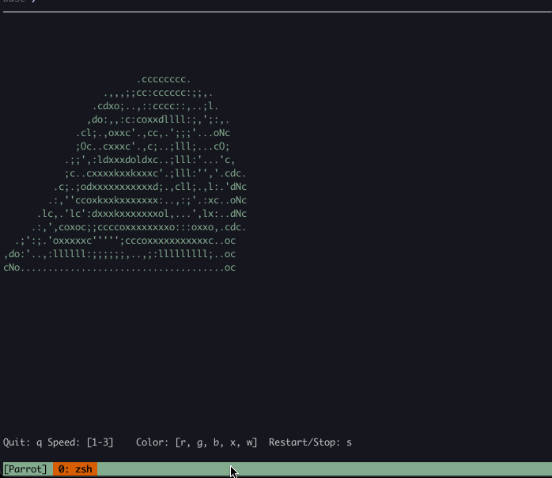

# Parrot-rs
Fast Parrot implemented by Rust

## Example

## Run!!
~~~
git clone https://github.com/th2ch-g/parrot-rs.git && \
cd ./parrot-rs && \
cargo run
~~~

## Compile as Binary
~~~
git clone https://github.com/th2ch-g/parrot-rs.git && \
cd ./parrot-rs && \
cargo build
~~~

## Reference
- [parrot.live](https://github.com/hugomd/parrot.live)